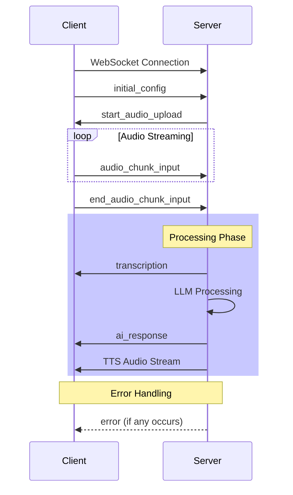

# Stream Protocol Documentation

## Overview

The real-time audio streaming system uses WebSocket for bidirectional communication between client and server. The protocol defines several message types for handling audio streaming, configuration, and responses.

## Message Types

### Configuration Messages

Used to initialize the streaming session.
```
{
    type: "initial_config",
    audio: {
        sampleRate: number,    // e.g., 16000
        channels: number,      // e.g., 1
        encoding: AudioEncoding // e.g., "WAV"
    }
}
```

### Audio Messages

Audio Chunk Input
Client sends audio data in base64 format:
```
{
    type: "audio_chunk_input",
    data: string  // base64 encoded audio chunk
}
```
End Audio Input
Signals the end of audio stream:
```
{
    type: "end_audio_chunk_input"
}
```

### Server Response Messages

Start Upload Confirmation
```
{
    type: "start_audio_upload"
}
```
Transcription Response
```
{
    type: "transcription",
    transcription: string
}
```
Final Transcriptions
```
{
    type: "final_transcriptions",
    transcriptions: string[]
}
```
AI Response
```
{
    type: "ai_response",
    response: string
}
```
Error Message
```
{
    type: "error",
    error: string
}
```

### Communication Flow



Error Handling
The server may send error messages in these cases:
Invalid configuration
Missing configuration before audio streaming
Processing failures (STT, LLM, or TTS)